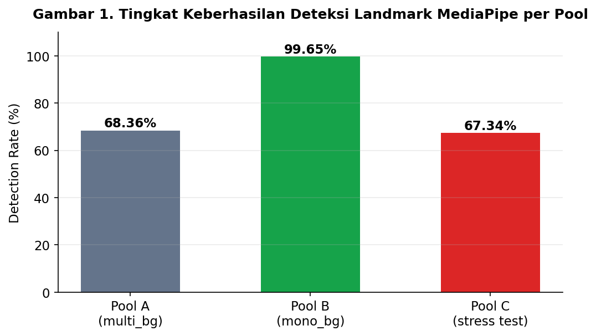
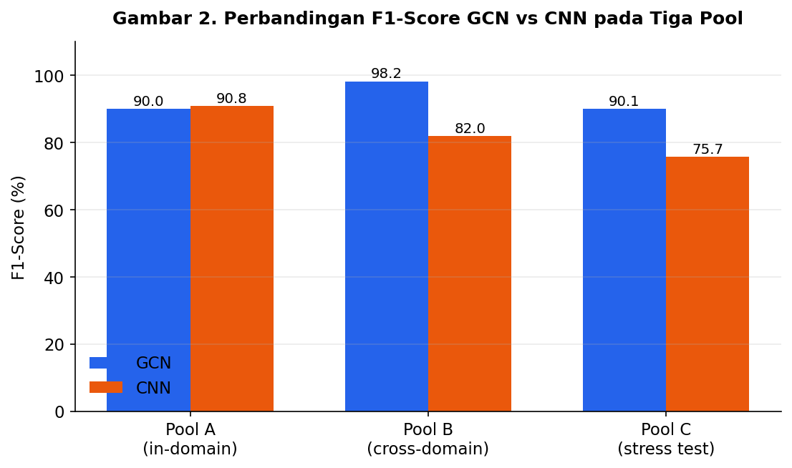
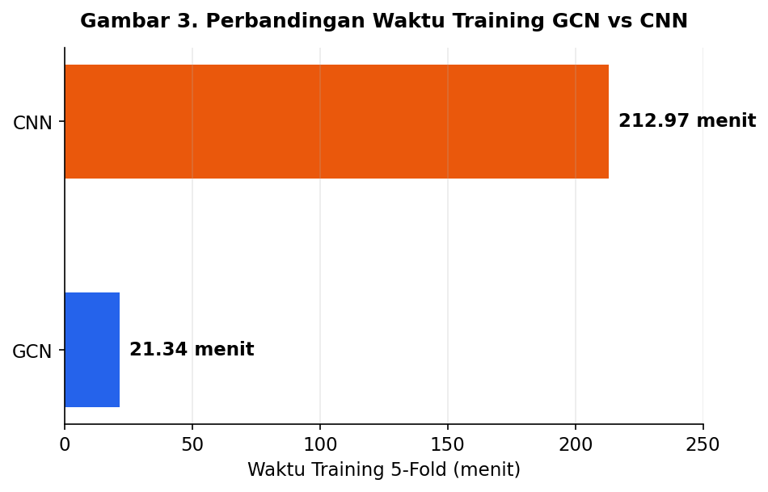

# Pengenalan Alfabet SIBI Berbasis Graph Convolutional Network dengan Purwarupa Antarmuka IoT

   
   *Gambar 1. Cover Projek*

Perbandingan representasi graf (GCN) vs representasi piksel (CNN) untuk pengenalan alfabet Sistem Isyarat Bahasa Indonesia (SIBI) berbasis landmark tangan MediaPipe, dilengkapi rancangan deployment cloud dan purwarupa IoT untuk komunikasi dua arah secara real-time.


## Penjelasan Singkat Proyek

Proyek skripsi ini membangun dan membandingkan dua pendekatan untuk mengenali 24 huruf statis alfabet SIBI (J dan Z dikecualikan karena membutuhkan gerakan): **Spatial Graph Convolutional Network (S-GCN)** yang memproses 21 titik landmark tangan hasil ekstraksi MediaPipe sebagai graf, dan **CNN berbasis piksel** yang memproses citra tangan secara langsung. Kedua model dilatih dan dievaluasi secara adil (jumlah parameter setara, subset data identik, skema validasi sama) untuk mengisolasi kontribusi representasi graf terhadap akurasi klasifikasi dan ketahanan model pada variasi latar belakang. Di luar perbandingan model, proyek ini juga merancang model GCN sebagai layanan cloud (FastAPI di Railway) serta purwarupa modul IoT berbasis ESP32 (speaker, motor getar, sensor ultrasonic, sensor cahaya) sebagai antarmuka fisik dua arah antara pengisyarat dan lawan bicara.

## Daftar Isi

- [Latar Belakang](#latar-belakang)
- [Pertanyaan Penelitian](#pertanyaan-penelitian)
- [Dataset](#dataset)
- [Metodologi](#metodologi)
- [Teori Dasar](#teori-dasar)
- [Tools](#tools)
- [Struktur Proyek](#struktur-proyek)
- [Insight](#insight)
- [Rekomendasi](#rekomendasi)
- [Saran](#saran)
- [Daftar Pustaka](#daftar-pustaka)
- [Author & Hak Cipta](#author--hak-cipta)

## Latar Belakang

Penyandang tunarungu dan tunawicara di Indonesia bergantung pada SIBI untuk berkomunikasi, termasuk alfabet manualnya untuk mengeja istilah yang belum punya isyarat baku (Nurhayati et al., 2022). Sebagian besar riset pengenalan bahasa isyarat di Indonesia masih memproses foto/video mentah lewat CNN berbasis piksel (Kelana et al., 2025; Fadzli & Rahardi, 2026), yang rentan terganggu perubahan pencahayaan dan latar belakang ramai (Al-Hammadi et al., 2022; Hu et al., 2024). Pendekatan berbasis landmark MediaPipe diklaim lebih tahan gangguan latar dan lebih ringan secara komputasi dibanding piksel mentah (Hu et al., 2024; Gonfa et al., 2025), namun klaim ini baru diuji di tahap klasifikasi, belum ada riset yang mengukur seberapa berhasil proses ekstraksi landmark itu sendiri, padahal MediaPipe dirancang untuk video (bukan foto tunggal) dan rawan gagal di latar belakang rumit (Lugaresi et al., 2019; Adhiyaksa & Suciati, 2022).

Tangan manusia pada dasarnya adalah jaringan sendi yang saling terhubung, mirip struktur graf, bukan sekadar kumpulan piksel. Graph Convolutional Network (GCN) dirancang untuk data berbentuk graf (Kipf & Welling, 2017; Yan et al., 2018) sehingga berpotensi menangkap hubungan geometris antar sendi, informasi penting untuk membedakan huruf yang bentuknya mirip (mis. M vs N, A vs S), dengan cara yang tidak dimiliki CNN berbasis piksel (Liu et al., 2025; Han et al., 2024). Namun belum ada riset lokal yang menguji langsung keunggulan representasi graf dibanding piksel pada huruf SIBI yang mirip, maupun kesiapan model GCN ringan dijalankan sebagai layanan cloud (You, 2025; Naayini, 2025) dan diintegrasikan dengan perangkat edge seperti ESP32 untuk komunikasi dua arah secara real-time (Yalabaka et al., 2024).

## Pertanyaan Penelitian

1. Bagaimana titik koordinat tangan hasil ekstraksi MediaPipe pada foto SIBI statis diubah menjadi graf yang bisa diproses GCN, menggantikan pendekatan CNN berbasis piksel mentah?
2. Seberapa besar pengaruh keberhasilan deteksi titik tangan oleh MediaPipe (pada latar belakang rumit dan pencahayaan tidak stabil) terhadap akurasi pengenalan huruf SIBI, dan bagaimana perbandingan akurasi GCN dengan CNN pada kondisi tersebut?
3. Sejauh mana GCN mampu mengurangi kesalahan klasifikasi pada pasangan huruf tangan yang rawan tertukar akibat kemiripan bentuk?
4. Seberapa siap model GCN dijalankan sebagai layanan web di cloud dan diakses lewat purwarupa antarmuka IoT?

## Dataset

Menggunakan **SIBI Alphabet Dataset** oleh Andriyanto, T. (2024), dipublikasikan lewat Mendeley Data ([DOI: 10.17632/yhsgmynccf.1](https://doi.org/10.17632/yhsgmynccf.1), lisensi CC BY 4.0), diakui Kementerian Pendidikan dan Kebudayaan RI. Dataset punya 26 kelas huruf (24 huruf statis + label tambahan), dan dibagi menjadi tiga pool yang saling terpisah untuk menghindari data leakage:

| Pool | Subset | Fungsi | Jumlah Gambar Asli |
|---|---|---|---|
| **A** | `sibi_alphabet_mono_bg_no_augmentation` | Basis in-domain (latar seragam) | 1.440 |
| **B** | `sibi_alphabet_multi_bg_no_augmentation` | Evaluasi cross-domain (latar beragam) | 7.200 |
| **C** | `sibi_alphabet_multi_bg_with_augmentation` (sampel stratified) | Stress test domain lebih sulit | 1.488 dari 19.439 |

**Rincian split Train / Val / Test per pool** (verifikasi langsung dari struktur folder dataset):

| Pool | Train | Val | Test | Stress | Total |
|---|---|---|---|---|---|
| Pool A (mono, no-aug) | 1.215 | 150 | 75 | – | 1.440 |
| Pool B (multi, no-aug) | 6.120 | 720 | 360 | – | 7.200 |
| Pool C (multi, stress) | – | – | – | 1.488 | 1.488 |

Subset `with_augmentation` penuh tidak dipakai sebagai basis utama agar augmentasi piksel bawaan dataset tidak mencampuri perbandingan representasi graf vs piksel. Pool C diambil lewat *stratified sampling* dari 19.439 gambar populasi asalnya, dan hanya dipakai untuk evaluasi langsung (tanpa fine-tuning maupun ikut rotasi K-Fold).

> 📓 **Catatan:** angka detection rate, hasil evaluasi, dan metrik lain yang lebih terbaru (hasil re-run eksperimen) dicatat langsung sebagai output cell di notebook `notebook/gcn-cnn_terdokumentasi_CRISPDM_v2_EDA_tambahan.ipynb`, jadikan notebook tersebut sebagai rujukan utama untuk angka paling mutakhir, karena beberapa nilai bisa berubah tiap kali pipeline ekstraksi landmark & training dijalankan ulang.

## Metodologi

Penelitian menggunakan pendekatan **eksperimental kuantitatif** dengan paradigma *design and evaluation*, mengikuti lima tahap:

1. **Identifikasi Masalah**, merumuskan tiga kesenjangan riset menjadi empat rumusan masalah (RM1–RM4).
2. **Studi Literatur**, SIBI, arsitektur GCN/S-GCN, pipeline MediaPipe, CNN sebagai pembanding, serta literatur pendukung purwarupa IoT.
3. **Dataset**, pengumpulan, pemilihan subset `no_augmentation`, pembagian tiga pool (A/B/C).
4. **Pengembangan Model**
   - Ekstraksi 21 landmark tangan via **MediaPipe Hands**, dengan *cascade recovery* enam tahap (deteksi langsung, CLAHE, koreksi gamma, segmentasi kulit YCrCb/HSV, retry confidence rendah) untuk memaksimalkan detection rate.
   - Normalisasi koordinat: translasi terhadap titik pusat (rata-rata 21 landmark) lalu penskalaan terhadap jarak Euclidean maksimum, ditambah dua fitur turunan (jarak ke pergelangan tangan, jarak ke pusat telapak), total 5 fitur per node.
   - Konstruksi graf: 21 node, 23 edge fisik anatomis (46 edge bidirectional), topologi tetap untuk seluruh sampel.
   - **Model utama (GCN):** 3 layer `GraphConv` (5→208→208→208) + BatchNorm + ReLU + Dropout, global mean-max pooling, FC ke 26 kelas (~100.282 parameter).
   - **Model pembanding (CNN):** 4 blok Conv2D (16/32/64/128 filter) + BatchNorm + ReLU + MaxPool/GAP + Dropout + FC (~101.274 parameter, disetarakan dengan GCN, selisih <3%).
   - Kedua model dilatih dengan **Stratified 5-Fold Cross-Validation**, konfigurasi identik (Adam, Cosine Annealing LR, batch size 32, early stopping, CrossEntropyLoss), indeks fold identik untuk kedua model demi fairness.
5. **Analisis Hasil**, evaluasi klasifikasi (akurasi/precision/recall/F1), evaluasi ketahanan domain (Pool A→B→C), analisis confusion matrix pada pasangan huruf mirip, serta pengujian kelayakan deployment cloud (FastAPI + Railway) dan fungsi purwarupa IoT (ESP32, speaker, motor getar, sensor ultrasonic, sensor cahaya).

## Teori Dasar

### 1. Normalisasi Koordinat Landmark

Koordinat mentah dari MediaPipe bersifat absolut terhadap dimensi foto. Normalisasi dilakukan lewat translasi terhadap titik pusat tangan (rata-rata 21 landmark), lalu penskalaan terhadap jarak Euclidean terjauh:

$$p_i' = p_i - p_{center}, \qquad p_i'' = \frac{p_i'}{\max_j \lVert p_j' \rVert + \epsilon}$$

Keterangan variabel:
- $p_i$: koordinat landmark ke-$i$ (dari 21 titik hasil ekstraksi MediaPipe)
- $p_{center}$: titik pusat tangan, dihitung sebagai rata-rata dari seluruh 21 koordinat landmark
- $p_i'$: koordinat landmark setelah translasi (posisi relatif terhadap titik pusat)
- $\max_j \lVert p_j' \rVert$: jarak Euclidean terjauh dari titik pusat ke landmark manapun, dipakai sebagai faktor skala
- $\epsilon$: konstanta kecil untuk menghindari pembagian dengan nol
- $p_i''$: koordinat akhir setelah translasi & penskalaan (bahan baku fitur node GCN)

### 2. Graph Convolutional Network (GCN)

Tangan direpresentasikan sebagai graf $G=(V, E)$ dengan 21 node (landmark) dan edge mengikuti struktur anatomis jari. Operasi graph convolution pada tiap layer S-GCN:

$$H^{(l+1)} = \sigma\left(\tilde{D}^{-1/2}\,\tilde{A}\,\tilde{D}^{-1/2}\,H^{(l)}\,W^{(l)}\right)$$

Keterangan variabel:
- $\tilde{D}_{ii} = \sum_j \tilde{A}_{ij}$: matriks degree diagonal dari $\tilde{A}$
- $H^{(l)}$: fitur node pada layer ke-$l$ (layer 0 = 5 fitur input: 3 koordinat ternormalisasi + 2 jarak turunan)
- $W^{(l)}$: bobot yang dipelajari model
- $\sigma$: fungsi aktivasi (ReLU)

Operasi $\tilde{D}^{-1/2}\tilde{A}\tilde{D}^{-1/2}$ menormalisasi adjacency matrix secara simetris, mencegah node berderajat tinggi mendominasi agregasi fitur. Representasi 21 node akhirnya diringkas lewat **global mean-pool** dan **max-pool** (digabung/concat) sebelum diklasifikasi lewat fully-connected layer ke 26 kelas.

### 3. CNN Berbasis Piksel (Model Pembanding)

Operasi konvolusi 2D dasar yang menggeser kernel $K$ di sepanjang citra $I$:

$$(I * K)(x, y) = \sum_{m}\sum_{n} I(x+m,\, y+n)\, K(m, n)$$

Keterangan variabel:
- $I$: citra input (matriks nilai piksel), dengan $I(x, y)$ nilai piksel pada posisi $(x, y)$
- $K$: kernel/filter konvolusi berukuran kecil (mis. 3×3) yang digeser di sepanjang citra
- $(x, y)$: posisi piksel pada citra output
- $(m, n)$: indeks posisi relatif di dalam kernel $K$
- $(I * K)(x, y)$: hasil konvolusi (peta fitur) pada posisi $(x, y)$, yaitu jumlah hasil kali nilai piksel dan bobot kernel di area tersebut

Diikuti Batch Normalization, aktivasi ReLU, dan MaxPooling untuk mengecilkan resolusi spasial secara bertahap (64×64 → 32×32 → 16×16 → 8×8), lalu Global Average Pooling dan fully-connected layer ke 26 kelas.

### 4. Metrik Evaluasi

**Detection rate**, proporsi foto yang berhasil dideteksi MediaPipe:

$$\text{Detection Rate} = \frac{\text{Jumlah sampel terdeteksi}}{\text{Total sampel}}$$

Keterangan: "Jumlah sampel terdeteksi" adalah banyaknya foto yang tangannya berhasil dideteksi MediaPipe (langsung atau lewat cascade recovery), dan "Total sampel" adalah seluruh foto pada pool yang diuji.

**Akurasi klasifikasi bersyarat** (dihitung hanya dari sampel yang berhasil terdeteksi):

$$\text{Accuracy} = \frac{TP + TN}{TP + TN + FP + FN}, \qquad
\text{Precision} = \frac{TP}{TP + FP}, \qquad
\text{Recall} = \frac{TP}{TP + FN}$$

$$F1 = 2 \times \frac{\text{Precision} \times \text{Recall}}{\text{Precision} + \text{Recall}}$$

Keterangan variabel:
- $TP$ (*true positive*): huruf yang benar diprediksi sesuai kelas aslinya
- $TN$ (*true negative*): huruf lain yang benar diprediksi bukan kelas tersebut
- $FP$ (*false positive*): huruf lain yang salah diprediksi sebagai kelas tersebut
- $FN$ (*false negative*): huruf kelas tersebut yang salah diprediksi sebagai kelas lain
- **Accuracy**: proporsi prediksi yang benar dari seluruh prediksi
- **Precision**: dari semua prediksi "kelas X", berapa persen yang benar-benar kelas X
- **Recall**: dari semua data yang sebenarnya kelas X, berapa persen berhasil terdeteksi sebagai kelas X
- **F1**: rata-rata harmonis Precision dan Recall, menyeimbangkan keduanya

di mana TP, TN, FP, FN dihitung per kelas untuk kasus klasifikasi 26 kelas, dilaporkan sebagai *weighted average*.

**Akurasi end-to-end**, menggabungkan kegagalan deteksi landmark dengan akurasi klasifikasi:

$$\text{Accuracy}_{end\text{-}to\text{-}end} = \text{Detection Rate} \times \text{Accuracy}_{conditional}$$

Keterangan: $\text{Accuracy}_{conditional}$ adalah akurasi klasifikasi yang dihitung hanya dari sampel yang berhasil terdeteksi (rumus Accuracy di atas); mengalikannya dengan Detection Rate memberi gambaran performa sistem secara menyeluruh, termasuk kegagalan di tahap deteksi landmark.

### 5. Stratified K-Fold Cross-Validation

Data dibagi menjadi $K=5$ fold dengan proporsi kelas terjaga di tiap fold (*stratified*). Performa akhir dilaporkan sebagai rata-rata dan standar deviasi metrik $m$ di seluruh fold:

$$\bar{m} = \frac{1}{K}\sum_{k=1}^{K} m_k, \qquad
\text{std} = \sqrt{\frac{1}{K}\sum_{k=1}^{K}(m_k - \bar{m})^2}$$

Keterangan variabel:
- $K$: jumlah fold (dalam penelitian ini $K=5$)
- $m_k$: nilai metrik (mis. akurasi) yang diukur pada fold ke-$k$
- $\bar{m}$: rata-rata metrik dari seluruh $K$ fold, dilaporkan sebagai performa akhir model
- $\text{std}$: standar deviasi metrik antar fold; makin kecil nilainya, makin stabil performa model di berbagai pembagian data

Standar deviasi yang kecil menunjukkan performa model relatif stabil antar fold.

## Tools

| Kategori | Tools / Teknologi | Fungsi |
|---|---|---|
| Bahasa Pemrograman | Python 3.10+ | Pengembangan seluruh pipeline |
| Deep Learning | PyTorch 2.0+ | Implementasi & training model GCN/CNN |
| Graph Learning | PyTorch Geometric | Implementasi layer graph convolution |
| Computer Vision | MediaPipe Hands | Ekstraksi 21 landmark tangan |
| Computer Vision | OpenCV | Praproses citra (cascade recovery deteksi) |
| Backend API | FastAPI | REST API endpoint inferensi model |
| Deployment Cloud | Railway | Hosting layanan model sebagai API |
| Containerization | Docker | Packaging deployment ke Railway |
| Komputasi Ilmiah | NumPy, SciPy | Operasi matriks & augmentasi |
| Analisis Data | Pandas | Manajemen dataset |
| Machine Learning Utilities | scikit-learn | Metrik evaluasi & Stratified K-Fold |
| Visualisasi | Matplotlib, Seaborn | Visualisasi hasil evaluasi |
| Experiment Tracking | MLflow | Pencatatan eksperimen & bobot model |
| Frontend | React, TypeScript, Vite | Antarmuka web pengguna |
| Mikrokontroler | ESP32 DevKit | Edge hub, menerima hasil prediksi |
| Sensor | HC-SR04 (ultrasonic) | Panduan jarak tangan ke kamera |
| Sensor | LDR / BH1750 (cahaya) | Deteksi kondisi pencahayaan |
| Output Audio | DFPlayer Mini + speaker | Keluaran suara huruf hasil prediksi |
| Output Haptik | Motor getar | Umpan balik getar untuk pengisyarat |
| Firmware | Arduino IDE / PlatformIO | Pemrograman ESP32 |
| Version Control | Git / GitHub | Manajemen versi kode |
| Database Migration | Alembic | Migrasi skema database backend |

## Struktur Proyek

```
sibi-translation/
├── backend/                 # Layanan API inferensi model (FastAPI)
│   ├── alembic/             # Migrasi skema database
│   ├── app/                 # Kode aplikasi backend (routes, model loading, dsb.)
│   ├── tests/               # Unit test backend
│   ├── venv/                # Virtual environment (tidak di-commit)
│   ├── .env.example         # Contoh konfigurasi environment variable
│   ├── alembic.ini          # Konfigurasi Alembic
│   ├── docker-compose.yml   # Orkestrasi container lokal
│   ├── Dockerfile           # Image backend untuk deployment (Railway)
│   ├── README.md            # Dokumentasi khusus backend
│   └── requirements.txt     # Dependensi Python backend
│
├── frontend/                # Antarmuka web (React + TypeScript + Vite)
│   ├── node_modules/        # Dependensi Node (tidak di-commit)
│   ├── public/              # Aset statis
│   ├── src/                 # Kode sumber komponen React
│   ├── package.json         # Dependensi & skrip frontend
│   ├── tsconfig*.json       # Konfigurasi TypeScript
│   ├── vite.config.ts       # Konfigurasi bundler Vite
│   └── README.md            # Dokumentasi khusus frontend
│
├── models/                  # Bobot model terlatih
│   └── sibi_gcn_model_standalone.pt   # Model GCN hasil export untuk deployment
│
├── notebook/                # Notebook eksperimen (ekstraksi landmark, training, evaluasi GCN vs CNN)
│
└── README.md                # Dokumentasi utama proyek (file ini)
```

**Alur singkat:** `notebook/` berisi seluruh eksperimen dari ekstraksi landmark sampai training & evaluasi GCN vs CNN → model terbaik di-export ke `models/` → `backend/` memuat bobot model tersebut dan mengekspos endpoint `POST /predict` lewat FastAPI → `frontend/` mengonsumsi endpoint itu sebagai antarmuka web bagi pengguna.

## Insight

1. **Ekstraksi landmark adalah bottleneck utama, bukan klasifikasi.** Detection rate MediaPipe anjlok dari 99,65% (latar polos, Pool B) menjadi 68,36% (latar ramai, Pool A), selisih 31 poin, dan tetap rendah (67,34%) pada Pool C meski faktor pembedanya bukan lagi latar belakang melainkan augmentasi piksel. Cascade recovery enam tahap berhasil menyelamatkan 596 sampel tambahan (12,1% dari total terdeteksi), tapi lebih dari sepertiga foto Pool A tetap gagal diproses.

   
   *Gambar 2. Tingkat keberhasilan deteksi landmark MediaPipe per pool (A: multi_bg, B: mono_bg, C: stress test).*

2. **GCN jauh lebih tahan pergeseran domain dibanding CNN.** Dari Pool A ke Pool C (domain lebih sulit), F1-score GCN hanya turun 0,10% (praktis stabil), sementara CNN kehilangan 16,62 poin F1. Di Pool B, GCN bahkan lebih akurat dibanding di Pool A sendiri (F1 0,9825 vs 0,9002), sedangkan CNN justru menurun (0,8204 vs 0,9084), mengonfirmasi bahwa representasi graf yang sudah dilepas dari konteks visual latar tidak terpengaruh perubahan latar belakang, berbeda dengan CNN yang memproses piksel latar secara langsung.

   
   *Gambar 3. Perbandingan F1-score GCN vs CNN pada Pool A (in-domain), Pool B (cross-domain), dan Pool C (stress test).*

3. **Pada akurasi klasifikasi in-domain, CNN sedikit unggul.** Pada test set held-out Pool A, CNN mencapai akurasi 90,91% vs GCN 90,08% (selisih +0,83 pp), keunggulan GCN dalam penelitian ini terletak pada ketahanan domain (lihat Gambar 2), bukan akurasi in-domain.

4. **GCN jauh lebih efisien dilatih.** Lima fold GCN selesai dalam 21,34 menit vs CNN 212,97 menit (≈10x lebih cepat) meski jumlah parameter hampir sama, karena GCN memproses graf kecil (21×5) sementara CNN memproses citra 64×64×3 piksel. Standar deviasi CV accuracy GCN juga lebih kecil (±0,80% vs ±1,90%), menunjukkan performa lebih stabil antar fold.

   
   *Gambar 4. Perbandingan waktu training 5-fold cross-validation antara GCN dan CNN.*

5. **Akurasi end-to-end jauh lebih rendah dari akurasi klasifikasi bersyarat.** Akurasi end-to-end GCN di Pool A (detection rate × akurasi klasifikasi = 0,6836 × 0,9008) hanya 61,58%, jauh di bawah akurasi klasifikasi bersyaratnya (90,08%, lihat Gambar 1 dan Gambar 2), menunjukkan kegagalan deteksi landmark, bukan kesalahan model, sebagai kontributor utama penurunan performa sistem secara keseluruhan.

6. **Keunggulan GCN pada huruf mirip belum terbukti.** Pada lima pasangan huruf paling sering tertukar hasil confusion matrix (R-U, C-O, E-S, A-D, A-L), CNN justru lebih akurat di 4 dari 5 pasangan. Namun ukuran sampel per pasangan sangat kecil (18–22 foto), sehingga selisih beberapa kesalahan saja bisa mengubah persentase secara signifikan, hasil ini belum bisa disimpulkan valid tanpa uji statistik (mis. McNemar test) dengan sampel lebih besar.

> Diagram di atas dibuat berdasarkan data hasil eksperimen pada BAB IV skripsi (Tabel 4.3, 4.10, dan 4.11). File sumber diagram tersedia di folder `assets/` repository ini.

## Rekomendasi

1. **Prioritaskan perbaikan tahap deteksi landmark**, bukan hanya arsitektur klasifikasi, karena selisih 29 poin antara akurasi klasifikasi bersyarat dan akurasi end-to-end GCN menunjukkan di sinilah kehilangan performa terbesar terjadi. Opsi: memakai MediaPipe Holistic, model deteksi tangan lain yang lebih tahan pada foto tunggal, atau menambah tahap cascade recovery.
2. **Gunakan GCN untuk skenario dengan variasi latar belakang tinggi** (kondisi dunia nyata di luar studio), dan pertimbangkan CNN atau pendekatan hybrid bila lingkungan capture bisa dikontrol (latar seragam) dan akurasi in-domain jadi prioritas utama.
3. **Uji ulang klaim keunggulan huruf mirip dengan sampel lebih besar** dan uji statistik formal (McNemar test) sebelum menyimpulkan representasi graf lebih baik atau lebih buruk untuk pasangan huruf seperti R-U, C-O, E-S, A-D, A-L.
4. **Lengkapi pengukuran deployment cloud (RM4)**, tabel latensi, throughput di bawah beban, dan estimasi biaya operasional pada dokumen skripsi saat ini masih kosong dan perlu diisi dari hasil pengujian aktual di Railway sebelum sidang/publikasi.
5. **Lengkapi pengujian fungsional purwarupa IoT** (kesesuaian output speaker/motor getar, latensi tambahan end-to-end, akurasi sensor ultrasonic/cahaya) yang saat ini masih berupa template kosong di BAB IV.

## Saran

- **Untuk pengembangan lanjutan model**: eksplorasi adjacency matrix adaptif/learnable (bukan hanya struktur fisik tetap) seperti pendekatan STDA-GCN, DSLNet, atau BlockGCN yang disebut di tinjauan pustaka, untuk melihat apakah fleksibilitas graf meningkatkan akurasi in-domain sekaligus mempertahankan ketahanan domain GCN saat ini.
- **Untuk cakupan data**: menambah unit pengenalan ke huruf dinamis (J, Z) dan ke level kata/kalimat kontinu, karena penelitian ini sengaja dibatasi pada 24 huruf statis dari citra tunggal.
- **Untuk purwarupa IoT**: arah pengembangan lanjutan yang sudah diidentifikasi mencakup sensor PIR dan ESP32-CAM (disebut namun belum diimplementasikan pada purwarupa saat ini) untuk mengurangi ketergantungan pada webcam laptop.
- **Untuk deployment**: pengujian saat ini dibatasi pada satu penyedia cloud (Railway); pengujian multi-cloud atau perbandingan biaya/latensi antar provider bisa jadi bahan riset lanjutan sebelum produksi skala lebih besar.
- **Struktur repository saat ini** (lihat folder `backend/`, `frontend/`, `models/`, `notebook/`) sudah memisahkan API (FastAPI), antarmuka web (React + Vite), bobot model (`sibi_gcn_model_standalone.pt`), dan notebook eksperimen, pertahankan pemisahan ini agar model bisa diganti/di-retrain tanpa mengubah lapisan API maupun frontend.

## Daftar Pustaka

- Adhiyaksa, F., & Suciati, N. (2022). *Normalisasi koordinat landmark tangan untuk pengenalan gestur berbasis MediaPipe.*
- Afwan, M., et al. (2026). Deep learning-based recognition of Indonesian Sign Language (BISINDO) alphabetic gestures using skeletal feature extraction and LSTM.
- Alaftekin, M., Pacal, I., & Cicek, K. (2024). Real-time sign language recognition based on YOLO algorithm. *Neural Computing and Applications, 36*(14), 7609–7624. https://doi.org/10.1007/s00521-024-09503-6
- Al-Hammadi, M., Muhammad, G., Abdul, W., Alsulaiman, M., Bencherif, M. A., & Mekhtiche, M. A. (2020). Hand gesture recognition for sign language using 3DCNN. *IEEE Access, 8*, 79491–79509.
- Al-Hammadi, M., Muhammad, G., Abdul, W., Alsulaiman, M., Bencherif, M. A., & Mekhtiche, M. A. (2022). Spatial attention-based 3D graph convolutional neural network for sign language recognition. *Sensors, 22*(12), 4558. https://doi.org/10.3390/s22124558
- Alam, M. S., et al. (2023). *PULSAR: Graph based positive unlabeled learning with multi stream adaptive convolutions* [Preprint]. arXiv. https://arxiv.org/abs/2312.05780
- Alsharif, B., Ilyas, M., et al. (2024). Transfer learning with YOLOv8 for real-time recognition system of American Sign Language Alphabet. *Franklin Open, 8*, 100165.
- Aljabar, M., & Suharjito. (2020). BISINDO (Bahasa Isyarat Indonesia) sign language recognition using CNN and LSTM.
- Andriyanto, T. (2024). *SIBI Alphabet Dataset* [Dataset]. Mendeley Data. https://doi.org/10.17632/yhsgmynccf.1
- Baihan, A., Alutaibi, A. I., Alshehri, M., & Sharma, S. K. (2024). Sign language recognition using modified deep learning network and hybrid optimization: A hybrid optimizer (HO) based optimized CNNSa-LSTM approach. *Scientific Reports, 14*, 26111. https://doi.org/10.1038/s41598-024-76174-7
- Du, Y., Xie, P., Wang, M., Hu, X., Zhao, Z., & Liu, J. (2022). Full transformer network with masking future for word-level sign language recognition. *Neurocomputing, 500*, 115–123.
- Fadzli, F., & Rahardi, R. (2026). Comparative analysis of MobileNetV3 and EfficientNetV2B0 in BISINDO hand sign recognition using MediaPipe landmarks. *Jurnal Aplikasi Informatika dan Komputer (JAIC), 10*(1).
- Gao, L., Li, H., Liu, Z., Liu, Z., Wan, L., & Feng, W. (2021). RNN-Transducer based Chinese Sign Language recognition. *Neurocomputing, 434*, 45–54.
- Gonfa, et al. (2025). A deep learning framework for Ethiopian Sign Language recognition using skeleton-based representation. *Scientific Reports.* https://doi.org/10.1038/s41598-025-19937-0
- Han, X., et al. (2024). Spatio-temporal dynamic attention graph convolutional network based on skeleton gesture recognition. *Electronics, 13*(18), 3733. https://doi.org/10.3390/electronics13183733
- Han, X., et al. (2025). Spatio-temporal transformer with Kolmogorov–Arnold network for skeleton-based hand gesture recognition.
- Hicks, S. A., Strümke, I., Thambawita, V., Hammou, M., Riegler, M. A., Halvorsen, P., & Parasa, S. (2022). On evaluation metrics for medical applications of artificial intelligence. *Scientific Reports, 12*, 5979. https://doi.org/10.1038/s41598-022-09954-8
- Ho, D., & Santoso, B. (2025). LSTM-based hand gesture recognition for Indonesian Sign Language system (SIBI) on affix, alphabet, number, and word.
- Hu, L., Gao, L., Liu, Z., & Feng, W. (2024). *Dynamic spatial-temporal aggregation for skeleton-aware sign language recognition* [Preprint]. arXiv. https://arxiv.org/abs/2403.12519
- icABCD. (2025). Optimising spatio-temporal graph convolutional networks for signer-independent sign language recognition. *Proceedings of icABCD 2025.* https://doi.org/10.1145/3759023.3759097
- Kelana, et al. (2025). Integrating the CNN model with the web for Indonesian Sign Language (BISINDO) recognition. *Jurnal Aplikasi Informatika dan Komputer (JAIC), 9*(3).
- Kipf, T. N., & Welling, M. (2017). Semi-supervised classification with graph convolutional networks. *Proceedings of the International Conference on Learning Representations (ICLR).*
- Kohavi, R. (1995). A study of cross-validation and bootstrap for accuracy estimation and model selection. *Proceedings of the 14th International Joint Conference on Artificial Intelligence (IJCAI), 2*, 1137–1143.
- Kothadiya, D., et al. (2023). SIGNFORMER: DeepVision transformer for sign language recognition. *IEEE Access, 11*, 17356–17369.
- Kumari, D., & Anand, R. S. (2024). Isolated video-based sign language recognition using a hybrid CNN-LSTM framework based on attention mechanism. *Electronics, 13*(7), 1229. https://doi.org/10.3390/electronics13071229
- Lemos, et al. (2026). Deep learning model deployment in multiple cloud providers: An exploratory study using low computing power environments [Preprint]. arXiv. https://arxiv.org/abs/2503.23988
- Li, D., Rodriguez, C., Yu, X., & Li, H. (2020). Word-level deep sign language recognition from video: A new large-scale dataset and methods comparison. *Proceedings of the IEEE/CVF Winter Conference on Applications of Computer Vision (WACV)*, 1459–1469.
- Li, et al. (2022). Multi-model running latency optimization in an edge computing paradigm. *Sensors, 22*(16), 6097. https://doi.org/10.3390/s22166097
- Liu, L., et al. (2025). *Skeleton-based sign language recognition using a dual-stream spatio-temporal dynamic graph convolutional network* [Preprint]. arXiv. https://arxiv.org/abs/2509.08661
- Lugaresi, C., Tang, J., Nash, H., McClanahan, C., Uboweja, E., Hays, M., Zhang, F., Chang, C.-L., Yong, M. G., Lee, J., Chang, W.-T., Hua, W., Georg, M., & Grundmann, M. (2019). *MediaPipe: A framework for building perception pipelines* [Preprint]. arXiv. https://arxiv.org/abs/1906.08172
- Miah, A. S. M., Hasan, M. A. M., Nishimura, S., & Shin, J. (2024). Sign language recognition using graph and general deep neural network based on large scale dataset. *IEEE Access, 12*, 34553–34569. https://doi.org/10.1109/ACCESS.2024.3372425
- Muthu Mariappan, H., & Gomathi, V. (2021). Indian Sign Language recognition through hybrid ConvNet-LSTM networks. *EMITTER International Journal of Engineering Technology, 9*(1), 182–203. https://doi.org/10.24003/emitter.v9i1.613
- Naayini, P. (2025). Building AI-driven cloud-native applications with Kubernetes and containerization. *International Journal of Scientific and Innovative Applications (IJSCIA), 6*(2), 328–340.
- Nurhayati, et al. (2022). *Sistem Isyarat Bahasa Indonesia (SIBI) metode Convolutional Neural Network sequential secara real time.*
- Pathan, R. K., Biswas, M., Yasmin, S., Khandaker, M. U., Salman, M., & Youssef, A. A. F. (2023). Sign language recognition using the fusion of image and hand landmarks through multi-headed convolutional neural network. *Scientific Reports, 13*, 16975. https://doi.org/10.1038/s41598-023-46257-5
- Putri, et al. (2025). Alphabet SIBI sign language recognition using YOLOv11 for real-time gesture detection.
- Rakhmadi, et al. (2025). CNN-based SIBI sign language recognition alphabet: Exploring the impact of hardware on model training.
- Rivera-Acosta, M., Ruiz-Varela, J. M., Ortega-Cisneros, S., Rivera, J., Parra-Michel, R., & Mejia-Alvarez, P. (2021). Spelling correction real-time American sign language alphabet translation system based on YOLO network and LSTM. *Electronics, 10*(9), 1035. https://doi.org/10.3390/electronics10091035
- Sari, et al. (2024). Real-time detection of Indonesian Sign Language (ISL) gestures based on long short-term memory.
- Shah, S., Vaidya, J., Pipariya, K., & Shah, M. (2024). A comprehensive study on relative distances of hand landmarks approach for American Sign Language gesture. *Augmented Human Research, 9*(1), 1. https://doi.org/10.1007/s41133-023-00068-8
- Tunga, A., Nuthalapati, S. V., & Wachs, J. (2021). Pose-based sign language recognition using GCN and BERT. *Proceedings of the IEEE/CVF Winter Conference on Applications of Computer Vision Workshops.*
- Utomo, et al. (2025). Indonesian language sign detection using MediaPipe with Long Short-Term Memory (LSTM) algorithm.
- Wieczorek, J., Guerin, C., & McMahon, T. (2022). K-fold cross-validation for complex sample surveys. *Stat, 11*(1), e454. https://doi.org/10.1002/sta4.454
- Wu, S., Li, Z., Li, S., Liu, Q., & Wu, W. (2023). Static gesture recognition algorithm based on improved YOLOv5s. *Electronics, 12*(3), 596. https://doi.org/10.3390/electronics12030596
- Yalabaka et al. (2024). Sign-to-speech system based on ESP32 for real-time gesture-to-audio conversion.
- Yan, S., Xiong, Y., & Lin, D. (2018). Spatial temporal graph convolutional networks for skeleton-based action recognition. *Proceedings of the AAAI Conference on Artificial Intelligence, 32*(1).
- You, X. (2025). Lightweight graph convolutional network with multi-attention mechanisms for intelligent action recognition. *PeerJ Computer Science.* https://doi.org/10.7717/peerj-cs.3050
- Zhou, Y., Yan, X., Cheng, Z.-Q., Yan, Y., Dai, Q., & Hua, X.-S. (2024). BlockGCN: Redefine topology awareness for skeleton-based action recognition. *Proceedings of the IEEE/CVF Conference on Computer Vision and Pattern Recognition (CVPR).*
- Zhu, Q., & Deng, H. (2023). Spatial adaptive graph convolutional network for skeleton-based action recognition. *Applied Intelligence, 53*, 17796–17808. https://doi.org/10.1007/s10489-022-04442-y

## Author & Hak Cipta

- **Penulis:** Defrizal Yahdiyan Risyad (NIM 2206131)
- **Program Studi:** S1 Ilmu Komputer, Fakultas Pendidikan Matematika dan Ilmu Pengetahuan Alam
- **Institusi:** Universitas Pendidikan Indonesia (UPI), Bandung, 2026
- **Pembimbing I:** Dr. Eddy Prasetyo Nugroho, M.T.
- **Pembimbing II:** Rizky Rachman J., M.T.
- **Judul Skripsi:** Pengenalan Alfabet Sistem Isyarat Bahasa Indonesia (SIBI) Berbasis Spatio-Graph Convolutional Network dengan Topologi Graf Hierarkis dan Augmentasi Data Berbasis Graf
- **LinkedIn:** [Defrizal Yahdiyan Risyad](https://www.linkedin.com/in/defrizalyr/)
- **Email:** defrijay@gmail.com

**Hak Cipta:**
- © 2026 Defrizal Yahdiyan Risyad. Hak Cipta Dilindungi Undang-Undang.
- Kode sumber pada repository ini dibagikan untuk keperluan portofolio dan referensi akademik; silakan hubungi penulis untuk penggunaan lebih lanjut.